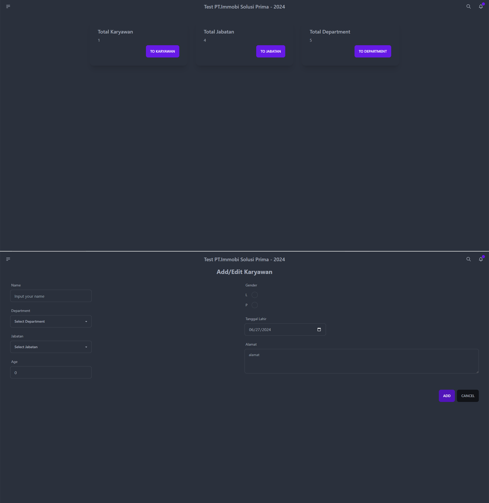

<h1 align="center">
  <a href="https://github.com/Alamnzr123/frontend_test2">
   CRUD Employee Web Application
  </a>
  <br />
</h1>



**CRUD Employee Web Application** is test for PT Immobi Solusi Prima **React**.
If any developer want adding another feature for further development are welcome **:)**

## Running on Local Development

1. Clone Frontend Repository - **https://github.com/Alamnzr123/frontend_test2**
2. Clone Backend Repository - **https://github.com/Alamnzr123/backendtest_2**
3. NPM install
4. Adding Database
5. Run using npm
```
  npm run dev
```

## Deploy on Vercel

The easiest way to deploy your Next.js app is to use the [Vercel Platform](https://vercel.com/new?utm_medium=default-template&filter=next.js&utm_source=create-next-app&utm_campaign=create-next-app-readme) from the creators of Next.js.

Check out our [Next.js deployment documentation](https://nextjs.org/docs/deployment) for more details.